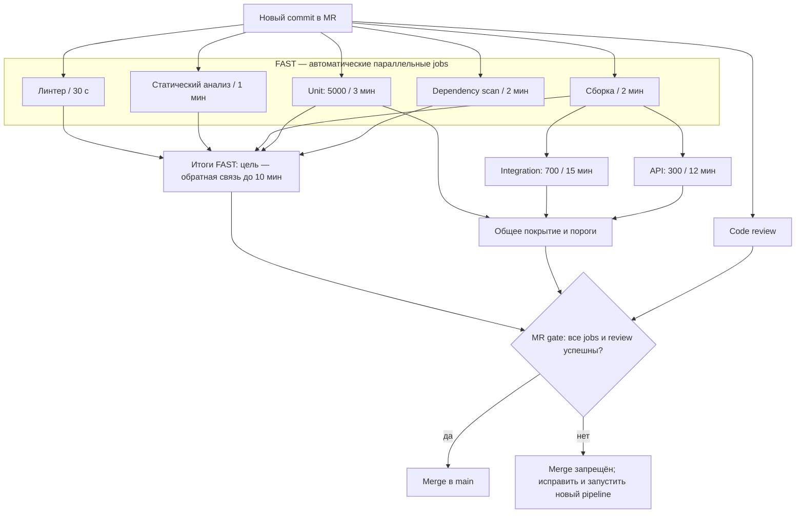
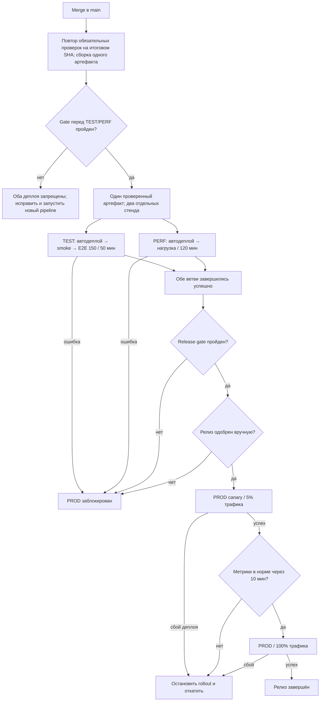

## Запускаемый учебный пример

В репозитории теперь есть маленькое приложение: `python main.py` печатает `Hello, world!`, а `shop.main:app` даёт HTTP-маршруты `/`, `/health` и демонстрационный `/checkout`. Оплата здесь только имитируется: денег и настоящих заказов приложение не сохраняет. `requirements.txt` содержит библиотеку приложения, `requirements-dev.txt` — инструменты CI. Исходный код лежит в `src/shop`, примерные тесты — в `tests`.

Локальный запуск на Python 3.12: `python -m pip install -r requirements-dev.txt`, затем `python -m pip install -e .`, `python main.py` и `pytest`. Команды линтера, анализа типов, сборки, тестов и проверки покрытия описаны в `.gitlab-ci.yml`. Поскольку репозиторий размещён на GitHub, файл `.github/workflows/example-ci.yml` запускает аналогичные проверки в GitHub Actions при открытии pull request и при push в `main`. Он не разворачивает приложение на TEST/PERF/PROD: реальные стенды, `ops/deploy.sh`, `ops/smoke.sh` и сценарий `perf/shop.js` ещё не созданы. Пример `tests/e2e` проходит через API внутри тестового процесса и не заменяет браузерный E2E на отдельном стенде.

## 1. Путь пользователя

Критический пользовательский путь: регистрация/вход → каталог → создание заказа → расчёт итоговой суммы → оплата → история заказов. Особенно опасны неверная сумма, двойное списание, доступ к чужому заказу и потеря заказа после успешной оплаты.

## 2. Схема

### MR → merge

Integration и API стартуют после **сборки**, не дожидаясь остальных FAST jobs. Покрытие объединяет unit, integration и API. MR gate ждёт **все** обязательные результаты и review; при любой ошибке merge запрещён.

### main → TEST/PERF → PROD

У gate перед TEST/PERF **один** выход «да». После него поток разделяется на параллельные TEST и PERF. Узел «Обе ветви завершились успешно» означает **И**: нужны оба результата, а не один на выбор. Ошибка деплоя, smoke, E2E или нагрузки блокирует PROD. Нагрузку проводим на отдельном PERF, чтобы она не исказила E2E на TEST. Ручное одобрение — отдельный gate: отказ останавливает релиз. Canary расширяется до 100% только при нормальных метриках; при сбое деплоя или ухудшении метрик выполняется откат. Шаги canary и отката должны быть реализованы в проектном `ops/deploy.sh` — учебный YAML задаёт только ручной запуск PROD.

## 3. Проверки, момент запуска и поведение при ошибке

| Проверка | Запуск и режим | Что блокирует | Параллельность | При падении / повтор |
|---|---|---|---|---|
| Линтер, 30 с | Автоматически на каждом push в MR и на main | Merge; деплой TEST | Параллельно со всем FAST | Исправить код. Перезапуск лишь при сбое runner. |
| Статический анализ, 1 мин | Так же | Merge; TEST | FAST | Новая блокирующая ошибка — исправление. |
| Сборка, 2 мин | Так же; сохраняет артефакт с SHA | Merge; TEST; PROD | FAST; затем открывает полные тесты | Ошибку компиляции/сборки исправить. |
| Unit, 5000 / 3 мин | Так же; отчёт JUnit и coverage | Merge; TEST | FAST | 0 падений. Повтор только для диагностики инфраструктуры. |
| Dependency scan, 2 мин | Так же по зафиксированным зависимостям | Merge; TEST; PROD | FAST | Обновить зависимость либо оформить ограниченное по сроку исключение после оценки безопасности. |
| Integration, 700 / 15 мин | Автоматически в MR и main | Merge; TEST | Параллельно с API после сборки | Исправить код/контракт/данные; диагностический retry не делает gate зелёным. |
| API, 300 / 12 мин | Автоматически в MR и main | Merge; TEST | Параллельно с integration | Аналогично. |
| E2E, 150 / 50 мин | Автоматически после деплоя TEST для main | PROD; merge не блокирует | Параллельно с нагрузкой на отдельном PERF | Дефект — стоп релиза; при доказанном сбое окружения восстановить стенд и повторить. |
| Нагрузка, 2 ч | Автоматически на релизном кандидате main в PERF | PROD; merge не блокирует | Параллельно с E2E только на отдельном стенде | Стоп релиза при нарушении SLO; повтор после устранения причины. |
| Code review | После готовности MR; люди | Merge | Не зависит от CI, но нужен для окончательного решения | Автор исправляет замечания; после нового коммита одобрения пересматриваются. |
| Deploy TEST/PERF | Автоматически после повторной проверки итогового SHA main | Переход к проверкам после деплоя | TEST и PERF можно разворачивать одновременно | Неуспешный деплой блокирует дальнейшее тестирование. |
| Deploy PROD | Ручной запуск уполномоченным после release gate | Выпуск версии | Только один PROD-деплой одновременно | Остановить rollout / откатить на предыдущий проверенный артефакт. |

Ни один обязательный job не имеет `allow_failure: true`. Отчёт сохраняется **и при ошибке**, чтобы было видно, что именно упало. Автоматический retry для assertion failure отключён: повторное прохождение не доказывает отсутствие дефекта.

## 4. Quality gates с конкретными порогами

### 4.1 MR gate — разрешение merge

1. **FAST:** линтер — 0 ошибок; статический анализ — 0 ошибок; сборка успешна; все 5000 unit-тестов проходят; dependency scan — 0 известных уязвимостей в runtime-зависимостях. Для учебного примера scan строже обычного порога HIGH/CRITICAL: одна известная уязвимость уже требует исправления или документированного исключения. Так проще проверить правило автоматически.
2. **FULL:** все 700 integration и 300 API сценариев проходят. Нет неожиданно пропущенных тестов. API тесты проверяют не только код ответа, но и схему, состояние данных и авторизацию.
3. **Покрытие объединённого набора unit + integration + API:** по строкам ≥ **80%**, по ветвям ≥ **70%**. Для изменённых строк ≥ **85%**. Для модулей расчёта цены, заказа, авторизации и оплаты: строки ≥ **95%**, ветви ≥ **90%**. Coverage считается по исполняемому коду, исключения из метрики ревьюятся; отчёт JUnit и coverage хранится как артефакт. Эти числа — начальная политика команды, а не гарантия качества: тесты для важных инвариантов обязательны и при 100% покрытии.
4. **Review:** минимум 1 независимое одобрение; для авторизации, расчёта суммы, заказа и оплаты — 2 одобрения, включая владельца области. Нет неразрешённых замечаний. Автор не одобряет свой MR.
5. Все обязательные проверки выполнены для **последнего SHA**. `main` защищён: прямой push запрещён, включено требование успешного pipeline. При возможности включается merged-results pipeline, чтобы проверять результат соединения с актуальным `main`.

**Почему такие пороги.** 80/70 дают широкую базовую защиту без требования тестировать бессмысленные строки; 85% изменённых строк не позволяет снижать качество новыми фичами; 95/90 для денежных и правовых инвариантов отражает более высокую стоимость дефекта. Пороги покрытия не заменяют проверки требований, граничных значений и негативных сценариев. Если текущий проект ниже цели, команда фиксирует временный исходный уровень, запрещает его снижать и повышает до цели согласованными шагами; нельзя внезапно считать невыполнимый порог действующим.

**Почему E2E не блокирует merge.** Полный набор занимает 50 минут и имеет больше зависимостей от стенда. Он обязателен до PROD. Риск после merge ограничен тем, что main ещё не выпускается в PROD, а основные бизнес-правила уже закрыты unit/integration/API. Для платежей и авторизации отдельные критические сценарии можно добавить в быстрый API набор без ожидания всех E2E.

### 4.2 Gate перед TEST

На итоговом коммите `main` ещё раз успешны FAST, integration, API и coverage; артефакт сборки имеет SHA и checksum; секреты и конфигурация тестового стенда доступны через защищённые переменные. Деплой теста автоматический. После деплоя проверяется health/readiness и короткий smoke: логин, каталог, создание заказа, расчёт суммы, тестовая оплата, история заказов. Если smoke падает, дальнейший переход запрещён. Повтор необходим, потому что фактический merge-коммит или изменившийся `main` могут отличаться от проверенной ветки MR.

### 4.3 Release gate перед PROD

На **том же артефакте** и релизном SHA: E2E 150/150 успешно; нагрузочный тест в отдельном PERF прошёл; 0 открытых дефектов severity 1–2 по критическому пути; нет новых известных уязвимостей; TEST smoke зелёный; ответственный подтверждает релиз. Предлагаемые численные SLO при согласованной нагрузке 100 виртуальных пользователей и тестовых данных: 5xx < **0,1%** запросов; p95 каталога < **300 мс**, создания заказа < **500 мс**, оплаты через тестовый шлюз < **800 мс**; ошибок расчёта суммы и двойных списаний — **0**. Эти значения нужно откалибровать под реальный SLA и возможности стенда до включения жёсткого gate. Если PERF не сопоставим с PROD, абсолютные миллисекунды нельзя честно использовать как блокирующее доказательство — сначала нужна репрезентативность среды.

PROD-деплой выполняется поэтапно: 5% трафика, 10 минут наблюдения, затем 100%. Во время canary 5xx не должен превысить 0,1%, p95 критических API — утверждённый SLO, не должно быть неверных платежных состояний. Нарушение останавливает rollout и инициирует откат. **Покрытие в PROD заново не измеряется:** gate требует тот же артефакт, для которого уже получен отчёт.

### 4.4 Что проверяют сами тесты

| Уровень | Примеры для интернет-магазина |
|---|---|
| Unit | Валидация email и пароля; роли; округление денег; сумма строк заказа, скидка, налог и доставка; пустая корзина; остатки; переходы состояний заказа; идемпотентный ключ оплаты. |
| Integration | Транзакция заказа и базы; конкурентное резервирование остатка; запись платежа и заказа без рассинхронизации; таймаут платёжного провайдера; повтор webhook; миграции; восстановление после сбоя очереди. |
| API | 200/201/400/401/403/404/409/422; схема ответа; запрет просмотра чужой истории; некорректные входные данные; пагинация каталога; повтор POST оплаты и заказа; корректная сумма в ответе. |
| E2E | От регистрации до тестовой оплаты и появления заказа в истории; отказ оплаты; повтор запроса; отмена/недоступный товар, если поддерживается продуктом; пользователь не видит чужой заказ. |
| Нагрузка | Каталог, создание заказа, расчёт и оплата при типичном и пиковом профиле; p95, доля 5xx, очередь, БД, ресурсы; отсутствие двойных платежей после параллельных запросов. |

## 5. Укладываемся ли по времени

Для расчёта предполагаются **как минимум 5 свободных runner-слотов** для FAST, ещё 2 слота для integration/API после сборки, прогретый кэш зависимостей и не более 2 минут суммарной очереди/подготовки. Это проверяемое операционное условие, а не свойство самого YAML.

| Этап | Исходные длительности | Критический путь без очереди | Оценка с резервом до 2 мин |
|---|---|---:|---:|
| Первые результаты MR | max(0,5; 1; 2; 3; 2) | **3 мин** | **до 5 мин**, запас до 10 мин — 5 мин |
| Полный MR gate | сборка 2 → max(integration 15; API 12), затем короткая агрегация отчёта | **≈17 мин + агрегация** | **≈19–21 мин**; merge ждёт полного gate |
| После main до release gate | прежние проверки → deploy TEST/PERF → max(E2E 50; нагрузка 120) | **≈137 мин + деплой/агрегация** | Не ограничено 10 минутами; нагрузка — критический путь |

Данное в условии «сейчас 6 минут на merge в master» — **исходное наблюдение о нынешнем pipeline**, а не сумма всех перечисленных тестов. Наше проектное решение меняет состав проверок, поэтому не выдаём 6 минут за срок полного нового gate. Длительность деплоя и агрегации в условии неизвестна; её следует измерить, а не придумать.

## 6. Когда тестовая база вырастет

С прогнозом unit 5, integration 25, API 20, E2E 70 минут и прежней сборкой 2 минуты: FAST = **5 минут** без очереди, **до 7 минут** с тем же резервом; FULL MR ≈ **27 минут + агрегация**; после main на PERF по-прежнему доминируют 2 часа нагрузки. Поэтому обещание «первые результаты за 10 минут» сохраняется, но merge будет ждать дольше. Если очередь/установка зависимостей выйдет за 5 минут, SLA FAST нарушится — нужны отдельные runner-слоты, кэш и мониторинг p95 времени FAST, а не только среднее.

| Изменение | Выгода | Риск и контроль |
|---|---|---|
| 5 параллельных FAST jobs, 2 полноценных jobs после сборки | Ранняя обратная связь, без потери тестов | Нехватка runner-слотов; резервировать пул и измерять очередь. |
| Разбить 700 integration на 5 сбалансированных shards, 300 API на 4 | 25/5 ≈ 5 мин и 20/4 ≈ 5 мин плюс setup; полный gate может сократиться | Общая БД и порядок тестов дают ложные результаты; каждому shard отдельная схема/контейнер, объединение отчётов, периодический прогон целого набора. |
| Кэш pip и собранный образ, отмена устаревших MR jobs | Меньше setup и бесполезных запусков | Устаревший кэш; привязка к lockfile, запрет отмены main/release jobs. |
| Запуск затронутых тестов раньше остальных | Раньше виден риск новой фичи | Ошибка в карте зависимостей; **полный** integration/API набор остаётся обязательным перед merge. |
| E2E после main и отдельный PERF | MR не ждёт 70 минут или 2 часа | Дефект может попасть в main; PROD строго закрыт до успеха E2E/нагрузки, rollback и hotfix доступны. |

## 7. Flaky-тесты и повторные запуски

Flaky-тест тест, который то проходит, то падает без изменения проверяемого поведения. При падении сохраняются логи, seed, JUnit, скриншоты/трейсы E2E и версии окружения. Разовый retry возможен **для диагностики** после явного сбоя runner/сети/стенда, но не меняет красный gate в зелёный без разбора. Критические тесты оплаты, суммы и доступа к данным не помещаются в карантин. Для некритического flaky-теста допустим временный карантин с issue, владельцем и сроком до 7 дней; он запускается nightly и сигналит о падении. Цель — <1% quarantined тестов от набора и движение к нулю. Молчаливое `skip`, бесконечные retry и «зелёный после второго раза» запрещены.
