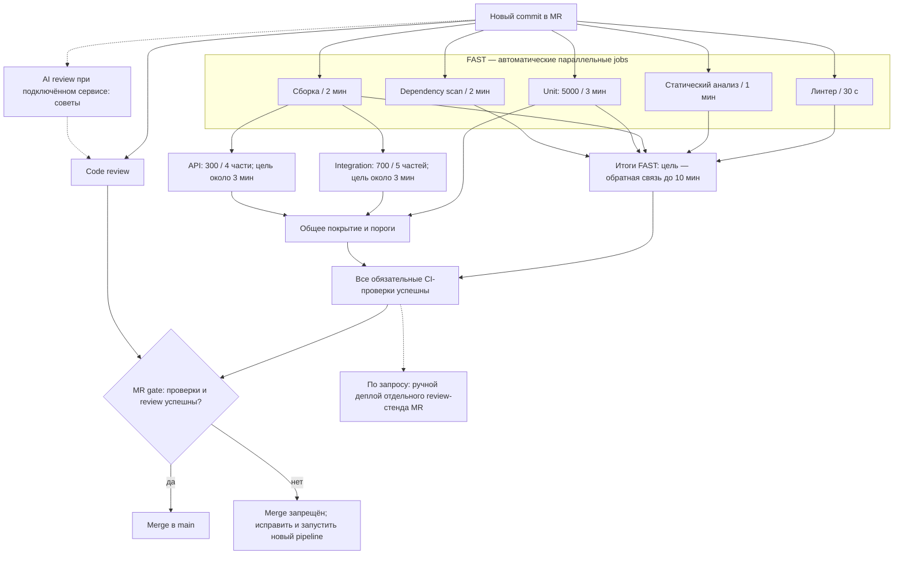
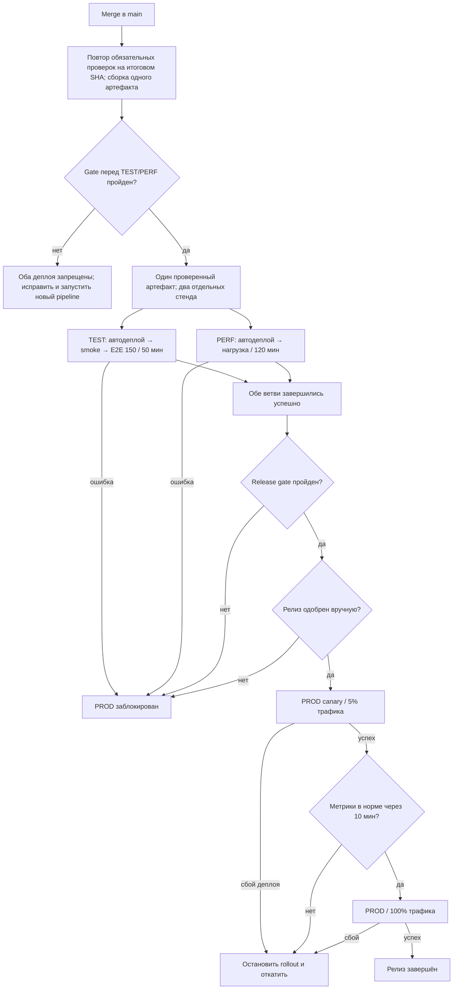

## Запускаемый учебный пример

[Доклад для выступления в порядке разделов README](Доклад_для_выступления.md).

В репозитории теперь есть маленькое приложение: `python main.py` печатает `Hello, world!`, а `shop.main:app` даёт HTTP-маршруты `/`, `/health` и демонстрационный `/checkout`. Оплата здесь только имитируется: денег и настоящих заказов приложение не сохраняет. `requirements.txt` содержит библиотеку приложения, `requirements-dev.txt` — инструменты CI. Исходный код лежит в `src/shop`, примерные тесты — в `tests`.

Локальный запуск на Python 3.12: `python -m pip install -r requirements-dev.txt`, затем `python -m pip install -e .`, `python main.py` и `pytest`. Команды линтера, анализа типов, сборки, тестов и проверки покрытия описаны в `.gitlab-ci.yml`. Поскольку репозиторий размещён на GitHub, файл `.github/workflows/example-ci.yml` запускает аналогичные проверки в GitHub Actions при открытии pull request и при push в `main`; для маленького примера он выполняет наборы тестов последовательно и **не доказывает** десятиминутный срок большого проекта. GitLab YAML здесь **не выполняется**. Реальные review/TEST/PERF/PROD-стенды, `ops/deploy.sh`, `ops/smoke.sh` и сценарий `perf/shop.js` ещё не созданы; добавленный ручной MR-деплой показывает место шага в будущем GitLab pipeline, но пока не может развернуть приложение. Пример `tests/e2e` проходит через API внутри тестового процесса и не заменяет браузерный E2E на отдельном стенде.

## 1. Путь пользователя

Критический пользовательский путь: регистрация/вход → каталог → создание заказа → расчёт итоговой суммы → оплата → история заказов. Особенно опасны неверная сумма, двойное списание, доступ к чужому заказу и потеря заказа после успешной оплаты.

## 2. Схема

### MR → merge

Integration и API стартуют после **сборки**, не дожидаясь остальных FAST jobs. Исходные 15 и 12 минут относятся к запуску каждого набора целиком. Чтобы уложить **весь автоматический MR pipeline** в целевые 10 минут, GitLab создаёт 5 частей integration и 4 части API. Идеальные 15/5 и 12/4 дают около 3 минут для самой долгой части каждого набора; реальное время зависит от равномерности тестов, подготовки и очереди. Покрытие объединяет unit, все части integration и API. MR gate ждёт **все** обязательные результаты и человеческое review; при любой ошибке merge запрещён. Пунктирные ветви необязательны: AI review даёт советы человеку, а ручной деплой из MR создаёт **отдельный** review-стенд после обязательных CI-проверок. Его неиспользование не задерживает merge и не заменяет общий TEST после merge. В GitLab такой ручной job должен иметь `allow_failure: true`, иначе при требовании успешного pipeline он может заблокировать merge.

### main → TEST/PERF → PROD

У gate перед TEST/PERF **один** выход «да». После него поток разделяется на параллельные TEST и PERF. Узел «Обе ветви завершились успешно» означает **И**: нужны оба результата, а не один на выбор. Ошибка деплоя, smoke, E2E или нагрузки блокирует PROD. Нагрузку проводим на отдельном PERF, чтобы она не исказила E2E на TEST. Ручное одобрение — отдельный gate: отказ останавливает релиз. Canary расширяется до 100% только при нормальных метриках; при сбое деплоя или ухудшении метрик выполняется откат. Шаги canary и отката должны быть реализованы в проектном `ops/deploy.sh` — учебный YAML задаёт только ручной запуск PROD.

## 3. Проверки, момент запуска и поведение при ошибке

| Проверка | Запуск и режим | Что блокирует | Параллельность | При падении / повтор |
|---|---|---|---|---|
| Линтер, 30 с | Автоматически на каждом push в MR и на main | Merge; деплой TEST | Параллельно со всем FAST | Исправить код. Перезапуск лишь при сбое runner. |
| Статический анализ, 1 мин | Так же | Merge; TEST | FAST | Новая блокирующая ошибка — исправление. |
| Сборка, 2 мин | Так же; сохраняет артефакт с SHA | Merge; TEST; PROD | FAST; затем открывает полные тесты | Ошибку компиляции/сборки исправить. |
| Unit, 5000 / 3 мин | Так же; отчёт JUnit и coverage | Merge; TEST | FAST | 0 падений. Повтор только для диагностики инфраструктуры. |
| Dependency scan, 2 мин | Так же по зафиксированным зависимостям | Merge; TEST; PROD | FAST | Обновить зависимость либо оформить ограниченное по сроку исключение после оценки безопасности. |
| Integration, 700 / 15 мин целиком | Автоматически в MR и main, **5 частей по времени тестов** | Merge; TEST | Все части параллельно с 4 частями API после сборки | Исправить код/контракт/данные; диагностический retry не делает gate зелёным. |
| API, 300 / 12 мин целиком | Автоматически в MR и main, **4 части по времени тестов** | Merge; TEST | Все части параллельно с integration | Аналогично. |
| E2E, 150 / 50 мин | Автоматически после деплоя TEST для main | PROD; merge не блокирует | Параллельно с нагрузкой на отдельном PERF | Дефект — стоп релиза; при доказанном сбое окружения восстановить стенд и повторить. |
| Нагрузка, 2 ч | Автоматически на релизном кандидате main в PERF | PROD; merge не блокирует | Параллельно с E2E только на отдельном стенде | Стоп релиза при нарушении SLO; повтор после устранения причины. |
| Code review | После готовности MR; люди | Merge в командном проекте | Не зависит от CI, но нужен для окончательного решения | Автор исправляет замечания; после нового коммита одобрения пересматриваются. |
| AI review | По желанию или автоматически, если подключён GitLab Duo/GitHub Copilot | Не является самостоятельным gate | Параллельно с тестами и человеческим review | Предложения проверяет человек; бот не входит в требуемое число людей. |
| Review-стенд MR | Ручной необязательный запуск **после** обязательных проверок; отдельная среда на каждый MR | Не блокирует merge; помогает показать изменение до merge | Не занимает runner при отсутствии запроса | При ошибке стенда исправить причину; не считать его общим TEST. |
| Deploy TEST/PERF | Автоматически после повторной проверки итогового SHA main | Переход к проверкам после деплоя | TEST и PERF можно разворачивать одновременно | Неуспешный деплой блокирует дальнейшее тестирование. |
| Deploy PROD | Ручной запуск уполномоченным после release gate | Выпуск версии | Только один PROD-деплой одновременно | Остановить rollout / откатить на предыдущий проверенный артефакт. |

Ни один обязательный job не имеет `allow_failure: true`; оно разрешено только для необязательного ручного review-стенда. Отчёт сохраняется **и при ошибке**, чтобы было видно, что именно упало. Автоматический retry для assertion failure отключён: повторное прохождение не доказывает отсутствие дефекта.

## 4. Quality gates с конкретными порогами

### 4.1 MR gate — разрешение merge

1. **FAST:** линтер — 0 ошибок; статический анализ — 0 ошибок; сборка успешна; все 5000 unit-тестов проходят; dependency scan — 0 известных уязвимостей в runtime-зависимостях. Для учебного примера scan строже обычного порога HIGH/CRITICAL: одна известная уязвимость уже требует исправления или документированного исключения. Так проще проверить правило автоматически.
2. **FULL:** все 700 integration и 300 API сценариев проходят. Нет неожиданно пропущенных тестов. API тесты проверяют не только код ответа, но и схему, состояние данных и авторизацию.
3. **Покрытие объединённого набора unit + integration + API:** по строкам ≥ **80%**, по ветвям ≥ **70%**. Для изменённых строк ≥ **85%**. Для модулей расчёта цены, заказа, авторизации и оплаты: строки ≥ **95%**, ветви ≥ **90%**. Coverage считается по исполняемому коду, исключения из метрики ревьюятся; отчёт JUnit и coverage хранится как артефакт. Эти числа — начальная политика команды, а не гарантия качества: тесты для важных инвариантов обязательны и при 100% покрытии.
4. **Review:** для обычного изменения — минимум **1 одобрение человека**, не автора и не последнего отправителя коммита. Для авторизации, цены, заказов, оплаты, CI-конфигурации и деплоя — **2 человека**, один из них владелец затронутой области. AI-бот может подсказать дефект, но не считается одним из этих людей. Все замечания закрыты; новый коммит требует повторного просмотра изменённой части.
5. Все обязательные проверки выполнены для **последнего SHA**. В реальном командном репозитории нужны защита `main`, запрет прямого push, обязательный успешный pipeline и, если доступно, проверка результата соединения MR с актуальным `main`. **В этом личном демонстрационном GitHub-репозитории защита ветки и обязательные одобрения сейчас не настроены**: без второго участника нельзя честно показать 1–2 независимых человеческих approval.

**Почему такие пороги.** 80/70 дают широкую базовую защиту без требования тестировать бессмысленные строки; 85% изменённых строк не позволяет снижать качество новыми фичами; 95/90 для денежных и правовых инвариантов отражает более высокую стоимость дефекта. Пороги покрытия не заменяют проверки требований, граничных значений и негативных сценариев. Если текущий проект ниже цели, команда фиксирует временный исходный уровень, запрещает его снижать и повышает до цели согласованными шагами; нельзя внезапно считать невыполнимый порог действующим.

**Почему E2E не блокирует merge.** Полный набор занимает 50 минут и имеет больше зависимостей от стенда. Он обязателен до PROD. Риск после merge ограничен тем, что main ещё не выпускается в PROD, а основные бизнес-правила уже закрыты unit/integration/API. Для платежей и авторизации отдельные критические сценарии можно добавить в быстрый API набор без ожидания всех E2E.

**Зачем ручной review-стенд и AI review.** Стенд нужен, когда тестировщику или заказчику важно увидеть изменение до merge; для каждого MR нужен свой адрес и тестовые данные, без production-секретов. Автоматический AI review можно включить средствами GitLab Duo или GitHub Copilot при наличии доступа; сам `.gitlab-ci.yml` не делает AI-вызов. Ответ AI — гипотеза для проверки, а не одобрение качества.

### 4.2 Gate перед TEST

На итоговом коммите `main` ещё раз успешны FAST, integration, API и coverage; артефакт сборки имеет SHA и checksum; секреты и конфигурация тестового стенда доступны через защищённые переменные. Деплой теста автоматический. После деплоя проверяется health/readiness и короткий smoke: логин, каталог, создание заказа, расчёт суммы, тестовая оплата, история заказов. Если smoke падает, дальнейший переход запрещён. Повтор необходим, потому что фактический merge-коммит или изменившийся `main` могут отличаться от проверенной ветки MR.

### 4.3 Release gate перед PROD

На **том же артефакте** и релизном SHA: E2E 150/150 успешно; нагрузочный тест в отдельном PERF прошёл; 0 открытых дефектов severity 1–2 по критическому пути; нет новых известных уязвимостей; TEST smoke зелёный. Затем релиз вручную подтверждает **1 уполномоченный выпускающий**; для изменения оплаты, авторизации или миграции БД команда дополнительно требует согласование **QA/владельца области**, то есть двух разных людей по процессу. В учебном YAML есть только один ручной запуск с повторным подтверждением кнопки: это **не два approval**. Для строгого технического требования двух людей нужны правила одобрения deployment в платформе и реальные участники команды. Предлагаемые численные SLO при согласованной нагрузке 100 виртуальных пользователей и тестовых данных: 5xx < **0,1%** запросов; p95 каталога < **300 мс**, создания заказа < **500 мс**, оплаты через тестовый шлюз < **800 мс**; ошибок расчёта суммы и двойных списаний — **0**. Эти значения нужно откалибровать под реальный SLA и возможности стенда до включения жёсткого gate. Если PERF не сопоставим с PROD, абсолютные миллисекунды нельзя честно использовать как блокирующее доказательство — сначала нужна репрезентативность среды.

PROD-деплой выполняется поэтапно: 5% трафика, 10 минут наблюдения, затем 100%. Во время canary 5xx не должен превысить 0,1%, p95 критических API — утверждённый SLO, не должно быть неверных платежных состояний. Нарушение останавливает rollout и инициирует откат. Перед запуском нужна проверка, что job относится к **актуальному** релизу, а не к старому pipeline; одновременные PROD-деплои ограничивает `resource_group`. **Покрытие в PROD заново не измеряется:** gate требует тот же артефакт, для которого уже получен отчёт. Canary, наблюдение и откат пока описаны как проектное решение, а не как работающий код.

### 4.4 Что проверяют сами тесты

| Уровень | Примеры для интернет-магазина |
|---|---|
| Unit | Валидация email и пароля; роли; округление денег; сумма строк заказа, скидка, налог и доставка; пустая корзина; остатки; переходы состояний заказа; идемпотентный ключ оплаты. |
| Integration | Транзакция заказа и базы; конкурентное резервирование остатка; запись платежа и заказа без рассинхронизации; таймаут платёжного провайдера; повтор webhook; миграции; восстановление после сбоя очереди. |
| API | 200/201/400/401/403/404/409/422; схема ответа; запрет просмотра чужой истории; некорректные входные данные; пагинация каталога; повтор POST оплаты и заказа; корректная сумма в ответе. |
| E2E | От регистрации до тестовой оплаты и появления заказа в истории; отказ оплаты; повтор запроса; отмена/недоступный товар, если поддерживается продуктом; пользователь не видит чужой заказ. |
| Нагрузка | Каталог, создание заказа, расчёт и оплата при типичном и пиковом профиле; p95, доля 5xx, очередь, БД, ресурсы; отсутствие двойных платежей после параллельных запросов. |

## 5. Укладываемся ли по времени

**Требование команды — весь автоматический MR pipeline не дольше 10 минут**, от push до готовности всех обязательных CI-проверок. При исходном запуске наборами целиком оно не выполняется: сборка 2 минуты, затем integration 15 и API 12 параллельно, то есть минимум **17 минут** без очереди. Поэтому в GitLab YAML integration разделён на 5 частей, API — на 4. `pytest-split` распределяет тесты, а `coverage_gate` ждёт **каждую** часть и объединяет отчёты.

Оценка ниже требует не менее **10 одновременно доступных runner-слотов** в пике: одна ещё идущая unit-проверка плюс 9 частей после сборки. Также нужны изолированные тестовые данные, прогретый кэш, равные по длительности части, агрегация покрытия не дольше 1 минуты и не больше 2 минут очереди/подготовки на критическом пути. Для балансировки по времени команда должна хранить и обновлять историю длительностей тестов (`.test_durations`): её получают репрезентативным полным прогоном `pytest tests/integration tests/api --store-durations` и добавляют в репозиторий. Без неё [pytest-split](https://github.com/jerry-git/pytest-split) делит тесты приблизительно поровну по числу. Все это проверяемые предположения, а не обещание, доказанное учебным репозиторием.

Необязательные AI review и ручной review-стенд **не входят** в бюджет автоматического MR pipeline и не задерживают обязательный CI gate. Человеческое review необходимо для merge, но его длительность нельзя гарантировать десятиминутным техническим SLA.

| Этап | Расчёт при указанных ресурсах | Критический путь без очереди | С резервом до 2 мин |
|---|---|---:|---:|
| FAST | max(0,5; 1; 2; 3; 2) | **3 мин** | **до 5 мин** |
| Весь автоматический MR gate | сборка 2 → max(15/5; 12/4) ≈ 3 → объединение ≤1 | **≈6 мин** | **целевые ≤8 мин**, запас до лимита 10 мин — около 2 мин |
| После main до release gate | повтор проверок → deploy TEST/PERF → max(E2E 50; нагрузка 120) | **больше 120 мин** | В лимит MR не входит; нагрузка — критический путь |

Цель проверяется по **p95 фактического времени от push до завершения CI**, а не только по идеальной арифметике. Если части выполняются неравномерно, runner стоят в очереди или агрегация долгая, 10 минут не достигнуты — нужно измерить причину и исправить её. Человеческое review не имеет гарантированной десятиминутной длительности. Данное в условии «сейчас 6 минут на merge в master» — наблюдение о прежнем pipeline, а не доказательство нового. Если под «весь pipeline за 10 минут» понимается ещё и выпуск в PROD, при обязательной **двухчасовой нагрузке** это требование математически несовместимо с текущими gate: нужно менять границы SLA или набор блокирующих проверок и явно принимать риск.

## 6. Когда тестовая база вырастет

С прогнозом unit 5, integration 25, API 20, E2E 70 минут и прежней сборкой 2 минуты нынешние 5 и 4 части дадут около `2 + max(25/5; 20/4) + 1 + 2 = 10` минут: **запаса нет**. Для сохранения лимита стоит увеличить число частей до **7 integration и 6 API**: тогда при ровном распределении `2 + max(25/7; 20/6) + 1 + 2 ≈ 8,6` минуты. Пиковая потребность вырастет до примерно 14 runner-слотов; без них ускорения не будет. Двухчасовая нагрузка после main остаётся длиннее E2E и не входит в десятиминутный MR SLA.

| Изменение | Выгода | Риск и контроль |
|---|---|---|
| 5 параллельных FAST jobs, затем 5 integration и 4 API части | Целевой полный MR gate меньше 10 минут без потери тестов | Нехватка runner-слотов; резервировать пул и измерять p95 очереди. |
| При росте перейти на 7 integration и 6 API частей | Около 3,6 и 3,3 минуты тестов на самую долгую часть при ровном балансе | Общая БД и порядок тестов дают ложные результаты; каждой части отдельная схема/контейнер, объединение отчётов, периодический прогон целого набора. |
| Кэш pip и собранный образ, отмена устаревших MR jobs | Меньше setup и бесполезных запусков | Устаревший кэш; привязка к lockfile, запрет отмены main/release jobs. |
| Запуск затронутых тестов раньше остальных | Раньше виден риск новой фичи | Ошибка в карте зависимостей; **полный** integration/API набор остаётся обязательным перед merge. |
| E2E после main и отдельный PERF | MR не ждёт 70 минут или 2 часа | Дефект может попасть в main; PROD строго закрыт до успеха E2E/нагрузки, rollback и hotfix доступны. |

## 7. Flaky-тесты и повторные запуски

Flaky-тест тест, который то проходит, то падает без изменения проверяемого поведения. При падении сохраняются логи, seed, JUnit, скриншоты/трейсы E2E и версии окружения. Разовый retry возможен **для диагностики** после явного сбоя runner/сети/стенда, но не меняет красный gate в зелёный без разбора. Критические тесты оплаты, суммы и доступа к данным не помещаются в карантин. Для некритического flaky-теста допустим временный карантин с issue, владельцем и сроком до 7 дней; он запускается nightly и сигналит о падении. Цель — <1% quarantined тестов от набора и движение к нулю. Молчаливое `skip`, бесконечные retry и «зелёный после второго раза» запрещены.

## 8. Что настроить в настоящем командном проекте

1. **Одобрения действительно должны блокировать merge.** В GitLab Free approval можно оставить, но обязательные правила числа одобрений доступны в Premium/Ultimate; в GitHub для публичного репозитория можно использовать ruleset с обязательными проверками и review. Устаревшее одобрение после нового коммита отзывается, замечания разрешаются, CI проверяется на последнем состоянии. Для правила «2 человека только на критичных путях» нужны соответствующие правила платформы и минимум два независимых участника. Источники: [GitLab approvals](https://docs.gitlab.com/user/project/merge_requests/approvals/), [GitHub rulesets](https://docs.github.com/en/repositories/configuring-branches-and-merges-in-your-repository/managing-rulesets/available-rules-for-rulesets).
2. **Review-стенд из MR изолировать.** У каждого MR — отдельная среда и данные, короткий срок жизни, очистка ресурсов после закрытия. `auto_stop_in` обозначен в YAML, но удаление реальных ресурсов потребует реализации stop-job и инфраструктуры. Секреты PROD нельзя давать коду из непроверенного MR. Источники: [GitLab review apps](https://docs.gitlab.com/ci/review_apps/), [защита CI-переменных](https://docs.gitlab.com/ci/variables/).
3. **AI review — вспомогательный канал.** GitLab Duo или GitHub Copilot можно подключить к MR/PR в настройках сервиса; доступность и стоимость зависят от аккаунта. В нашей политике бот даёт замечания, а решение остаётся за людьми. Это не заменяет CI, тесты и требуемые человеческие одобрения. Источники: [GitLab Duo Code Review](https://docs.gitlab.com/user/gitlab_duo/code_review/), [GitHub Copilot code review](https://docs.github.com/en/copilot/how-tos/use-copilot-agents/request-a-code-review/use-code-review).
4. **Выпуск защитить от ошибочного клика и старого pipeline.** `resource_group` сериализует PROD-деплои, а `manual_confirmation` заставляет подтвердить запуск, но не создаёт второго одобряющего. На GitLab с защищённым окружением можно задать отдельные правила одобрения deployment; дополнительно включают защиту от устаревших deployment jobs и при необходимости окно запрета релизов. Источники: [ручные jobs](https://docs.gitlab.com/ci/jobs/job_control/), [deployment approvals](https://docs.gitlab.com/ci/environments/deployment_approvals/), [deployment safety](https://docs.gitlab.com/ci/environments/deployment_safety/).
5. **Перед реальным запуском дополнить проверки по рискам:** сканирование утечек секретов, проверку совместимости миграций БД и проверку отката на стенде. Для каждой новой обязательной проверки измеряют влияние на **полный десятиминутный MR gate**; длительные проверки можно поставить после него, но до выпуска, если команда принимает риск между merge и PROD.

В текущем публичном GitHub-репозитории уже включены **secret scanning**, защита от push секретов, **Dependabot alerts** и **Dependabot security updates**. Последний сервис может создать PR с исправлением уязвимой зависимости, но не объединяет его в `main` сам. GitHub branch ruleset, обязательные человеческие approval и AI review не включены.
